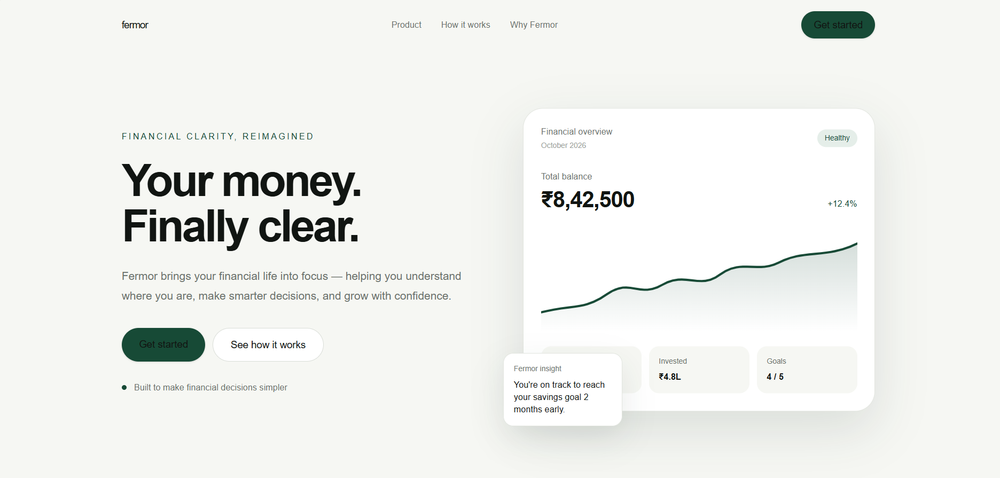
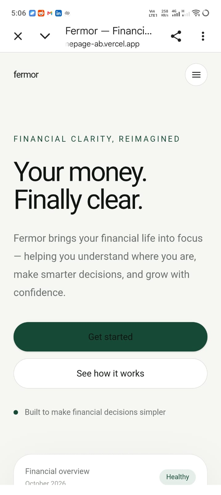

# Fermor — Financial Clarity Homepage

A responsive homepage concept for Fermor, designed around the idea of making personal finance feel clearer, simpler, and more actionable.

## Live Demo

https://fermor-homepage-ab.vercel.app/

## Overview

This project was created as a frontend development assignment for Fermor.

The homepage focuses on presenting Fermor as a modern financial product with a clear visual hierarchy and a simple user journey:

## Screenshots

### Desktop



### Mobile



**Understand → Act → Grow**

The design aims to make financial information feel approachable without overwhelming the user.

## Features

- Responsive desktop and mobile layout
- Mobile navigation menu
- Hero section with financial dashboard UI
- Product overview section
- Financial overview cards
- Savings and investment visualization
- Fermor insight card
- "Why Fermor" value proposition section
- Call-to-action section
- Smooth scrolling navigation
- Hover interactions and subtle UI animations
- Responsive typography and spacing

## Tech Stack

- Next.js
- React
- TypeScript
- Tailwind CSS
- Vercel

## Design Approach

The design uses a minimal, finance-focused visual language:

- Off-white background for a clean appearance
- Dark typography for readability
- Green accent color associated with financial growth
- Large, clear typography for hierarchy
- Dashboard-style UI to make the product concept tangible
- Minimal interactions to maintain a trustworthy and professional feel

## Project Structure

```text
fermor-homepage/
├── public/
├── src/
│   └── app/
│       ├── globals.css
│       ├── layout.tsx
│       └── page.tsx
├── package.json
├── README.md
└── ...


## Getting Started

Clone the repository:

```bash
git clone https://github.com/Abhishekmt16/fermor-homepage.git
cd fermor-homepage
